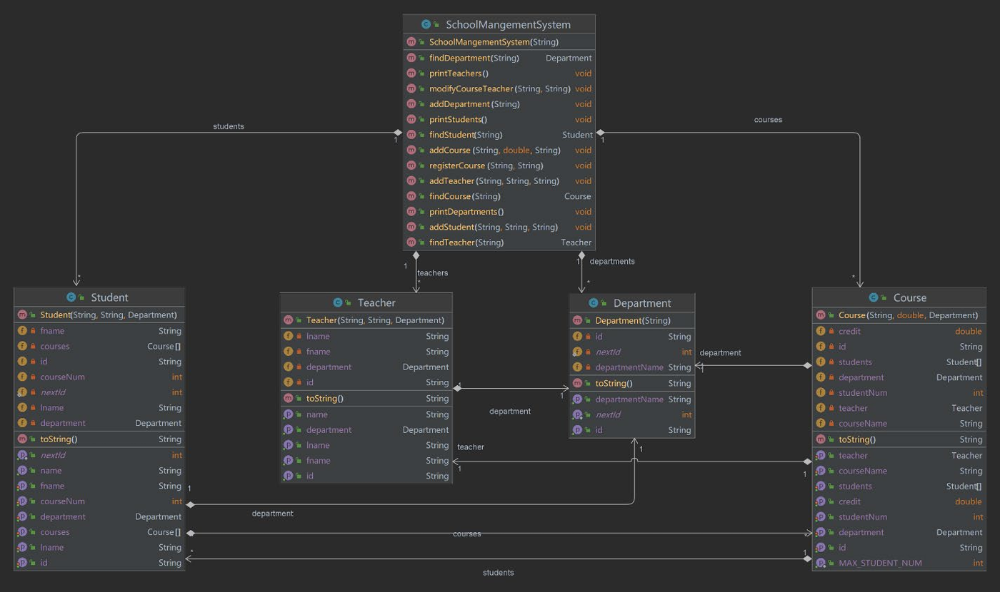

# SchoolManagementSystem
CS Final Project, School Acc Version

Name : Cihao Zhang  
Course : Introduction to Programming (420-201-RE)  
Details : A school management system that manages the school system by adding, finding and removing teachers, courses, students and departments.  

Class Diagram

